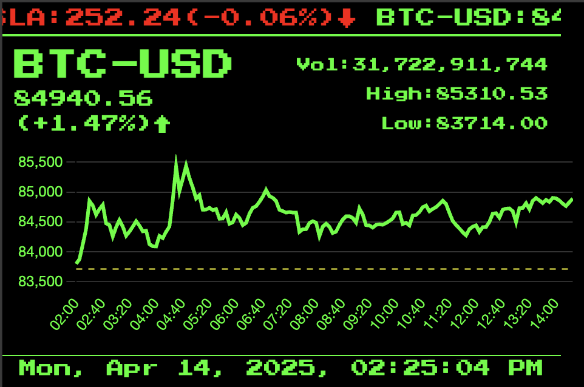

# Stocks Ticker

A simple project to display real-time stock prices and market data. This project is intended to run on a Raspberry Pi with a 3.5-inch LCD display. It pulls stock data from Yahoo finance API.



## Configuration

To configure the app, edit `app.js`:

1. Update `tickers` with stock symbols, e.g.:
   ```javascript
   tickers: ['AAPL', 'GOOGL', 'MSFT'],
   ```
2. Set `rotationInterval` (in seconds), e.g.:
   ```javascript
   rotationInterval: 5,
   ```
3. Save and restart the app.

## Installation

1. Clone the repository:
   ```bash
   git clone https://github.com/yourusername/stocksTicker.git
   ```
2. Navigate to the project directory:
   ```bash
   cd stocksTicker
   ```
3. Install dependencies:
   ```bash
   npm install
   ```

## Usage

1. Start the application:
   ```bash
   npm start
   ```
2. Open your browser and navigate to:
   ```
   http://localhost:3000
   ```

## License

This project is licensed under the [MIT License](LICENSE).
